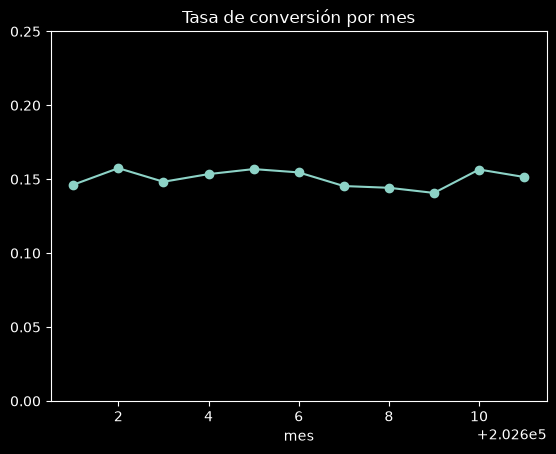
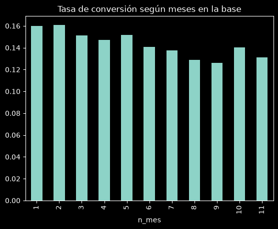
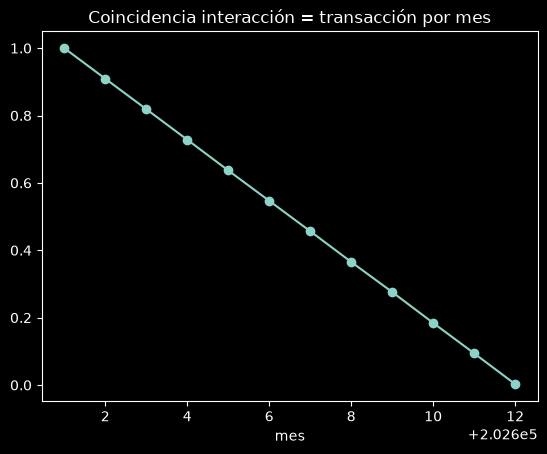
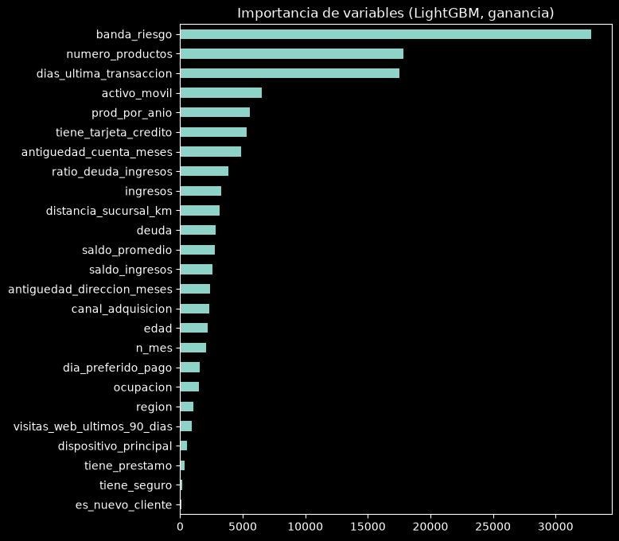

# Reto: Propensión de conversión de clientes
**Objetivo:** ordenar a los clientes de diciembre 2026 según su probabilidad de convertir.
**Métrica:** Gini = 2·AUC − 1 (solo importa el *orden* de las predicciones).

Estructura del notebook:
1. Configuración y carga de datos
2. Análisis exploratorio (EDA)
3. Hallazgo clave: la variable `dias_ultima_interaccion` cambia en el tiempo (drift)
4. Ingeniería de variables
5. Validación temporal
6. Modelos: Regresión logística, LightGBM, CatBoost
7. Ensamble y selección
8. Interpretación (importancia de variables)
9. Entrenamiento final y archivo de entrega
10. Próximos pasos para el equipo

## 1. Configuración y carga de datos
En Colab: ejecuta la celda y sube los 4 CSV (`train.csv`, `test.csv`, `sample_submission.csv`, `metaData.csv`) cuando se abra el selector. Si ya están en la carpeta, no te los pedirá.


```python
!pip install -q lightgbm catboost

```


```python
!pip install scikit-learn
```

    Requirement already satisfied: scikit-learn in .\.venv\Lib\site-packages (1.9.1)
    Requirement already satisfied: numpy>=1.24.1 in .\.venv\Lib\site-packages (from scikit-learn) (2.5.3)
    Requirement already satisfied: scipy>=1.10.0 in .\.venv\Lib\site-packages (from scikit-learn) (1.18.1)
    Requirement already satisfied: joblib>=1.4.0 in .\.venv\Lib\site-packages (from scikit-learn) (1.6.0)
    Requirement already satisfied: narwhals>=2.0.1 in .\.venv\Lib\site-packages (from scikit-learn) (2.26.0)
    Requirement already satisfied: threadpoolctl>=3.5.0 in .\.venv\Lib\site-packages (from scikit-learn) (3.7.0)
    Requirement already satisfied: cloudpickle>=3.0 in .\.venv\Lib\site-packages (from joblib>=1.4.0->scikit-learn) (3.1.2)
    


```python
import os, time, warnings
import numpy as np, pandas as pd, matplotlib.pyplot as plt
import lightgbm as lgb
from catboost import CatBoostClassifier
from sklearn.metrics import roc_auc_score
from sklearn.linear_model import LogisticRegression
from sklearn.preprocessing import OneHotEncoder, StandardScaler
from sklearn.compose import ColumnTransformer
from sklearn.pipeline import make_pipeline
from sklearn.model_selection import cross_val_predict, GroupKFold
from scipy.stats import rankdata
warnings.filterwarnings('ignore')
pd.set_option('display.max_columns', 50)
SEED = 42

DATA_DIR = os.environ.get('DATA_DIR', '.')
necesarios = ['train.csv', 'test.csv', 'sample_submission.csv']
if not all(os.path.exists(os.path.join(DATA_DIR, f)) for f in necesarios):
    try:
        from google.colab import files
        print('Sube train.csv, test.csv, sample_submission.csv y metaData.csv')
        files.upload()
        DATA_DIR = '.'
    except ImportError:
        raise FileNotFoundError('Coloca los CSV en la carpeta de trabajo o define DATA_DIR')

train = pd.read_csv(os.path.join(DATA_DIR, 'train.csv'))
test  = pd.read_csv(os.path.join(DATA_DIR, 'test.csv'))
sub   = pd.read_csv(os.path.join(DATA_DIR, 'sample_submission.csv'))
print('train', train.shape, '| test', test.shape, '| submission', sub.shape)
print('Valores faltantes en train:', train.isna().sum().sum(), '| en test:', test.isna().sum().sum())
train.head()
```

    train (110100, 25) | test (9900, 24) | submission (9900, 2)
    Valores faltantes en train: 0 | en test: 0
    


<div>
<style scoped>
    .dataframe tbody tr th:only-of-type {
        vertical-align: middle;
    }

    .dataframe tbody tr th {
        vertical-align: top;
    }

    .dataframe thead th {
        text-align: right;
    }
</style>
<table border="1" class="dataframe">
  <thead>
    <tr style="text-align: right;">
      <th></th>
      <th>id_cliente</th>
      <th>mes</th>
      <th>edad</th>
      <th>ingresos</th>
      <th>ratio_deuda_ingresos</th>
      <th>antiguedad_cuenta_meses</th>
      <th>numero_productos</th>
      <th>saldo_promedio</th>
      <th>dias_ultima_transaccion</th>
      <th>ocupacion</th>
      <th>region</th>
      <th>canal_adquisicion</th>
      <th>banda_riesgo</th>
      <th>tiene_tarjeta_credito</th>
      <th>activo_movil</th>
      <th>es_nuevo_cliente</th>
      <th>tiene_prestamo</th>
      <th>antiguedad_direccion_meses</th>
      <th>visitas_web_ultimos_90_dias</th>
      <th>distancia_sucursal_km</th>
      <th>dispositivo_principal</th>
      <th>dia_preferido_pago</th>
      <th>tiene_seguro</th>
      <th>dias_ultima_interaccion</th>
      <th>objetivo</th>
    </tr>
  </thead>
  <tbody>
    <tr>
      <th>0</th>
      <td>1</td>
      <td>202601</td>
      <td>26</td>
      <td>42120.349663</td>
      <td>0.367310</td>
      <td>139</td>
      <td>2</td>
      <td>40949.765573</td>
      <td>67</td>
      <td>professional</td>
      <td>west</td>
      <td>web</td>
      <td>low</td>
      <td>False</td>
      <td>True</td>
      <td>False</td>
      <td>False</td>
      <td>222</td>
      <td>10</td>
      <td>9.898223</td>
      <td>android</td>
      <td>21</td>
      <td>True</td>
      <td>67</td>
      <td>0</td>
    </tr>
    <tr>
      <th>1</th>
      <td>2</td>
      <td>202601</td>
      <td>56</td>
      <td>89837.390440</td>
      <td>0.338092</td>
      <td>29</td>
      <td>2</td>
      <td>35233.622561</td>
      <td>304</td>
      <td>manager</td>
      <td>west</td>
      <td>web</td>
      <td>low</td>
      <td>False</td>
      <td>True</td>
      <td>False</td>
      <td>False</td>
      <td>58</td>
      <td>2</td>
      <td>9.311922</td>
      <td>ios</td>
      <td>20</td>
      <td>True</td>
      <td>304</td>
      <td>0</td>
    </tr>
    <tr>
      <th>2</th>
      <td>3</td>
      <td>202601</td>
      <td>34</td>
      <td>45951.715455</td>
      <td>0.444587</td>
      <td>21</td>
      <td>2</td>
      <td>39486.902998</td>
      <td>220</td>
      <td>clerical</td>
      <td>north</td>
      <td>web</td>
      <td>high</td>
      <td>True</td>
      <td>True</td>
      <td>False</td>
      <td>False</td>
      <td>8</td>
      <td>6</td>
      <td>12.188249</td>
      <td>android</td>
      <td>12</td>
      <td>False</td>
      <td>220</td>
      <td>0</td>
    </tr>
    <tr>
      <th>3</th>
      <td>4</td>
      <td>202601</td>
      <td>62</td>
      <td>54673.148516</td>
      <td>0.243261</td>
      <td>43</td>
      <td>2</td>
      <td>300.000000</td>
      <td>110</td>
      <td>manual</td>
      <td>north</td>
      <td>partner</td>
      <td>high</td>
      <td>False</td>
      <td>False</td>
      <td>False</td>
      <td>False</td>
      <td>119</td>
      <td>9</td>
      <td>10.459796</td>
      <td>ios</td>
      <td>20</td>
      <td>False</td>
      <td>110</td>
      <td>0</td>
    </tr>
    <tr>
      <th>4</th>
      <td>5</td>
      <td>202601</td>
      <td>37</td>
      <td>100239.135609</td>
      <td>0.230946</td>
      <td>113</td>
      <td>1</td>
      <td>32066.808006</td>
      <td>247</td>
      <td>professional</td>
      <td>north</td>
      <td>partner</td>
      <td>medium</td>
      <td>True</td>
      <td>True</td>
      <td>False</td>
      <td>False</td>
      <td>25</td>
      <td>6</td>
      <td>36.502645</td>
      <td>ios</td>
      <td>13</td>
      <td>False</td>
      <td>247</td>
      <td>1</td>
    </tr>
  </tbody>
</table>
</div>


## 2. Análisis exploratorio
### 2.1 Tasa de conversión por mes
Si la tasa es estable, el problema no tiene estacionalidad fuerte.


```python
tasa_mes = train.groupby('mes')['objetivo'].agg(filas='size', tasa='mean')
print('Tasa global de conversión:', round(train.objetivo.mean(), 4))
display(tasa_mes.round(3))
tasa_mes['tasa'].plot(marker='o', title='Tasa de conversión por mes', ylim=(0, 0.25)); plt.show()
```

    Tasa global de conversión: 0.1505
    


<div>
<style scoped>
    .dataframe tbody tr th:only-of-type {
        vertical-align: middle;
    }

    .dataframe tbody tr th {
        vertical-align: top;
    }

    .dataframe thead th {
        text-align: right;
    }
</style>
<table border="1" class="dataframe">
  <thead>
    <tr style="text-align: right;">
      <th></th>
      <th>filas</th>
      <th>tasa</th>
    </tr>
    <tr>
      <th>mes</th>
      <th></th>
      <th></th>
    </tr>
  </thead>
  <tbody>
    <tr>
      <th>202601</th>
      <td>10400</td>
      <td>0.146</td>
    </tr>
    <tr>
      <th>202602</th>
      <td>9800</td>
      <td>0.157</td>
    </tr>
    <tr>
      <th>202603</th>
      <td>10300</td>
      <td>0.148</td>
    </tr>
    <tr>
      <th>202604</th>
      <td>9600</td>
      <td>0.153</td>
    </tr>
    <tr>
      <th>202605</th>
      <td>10100</td>
      <td>0.157</td>
    </tr>
    <tr>
      <th>202606</th>
      <td>10350</td>
      <td>0.155</td>
    </tr>
    <tr>
      <th>202607</th>
      <td>9700</td>
      <td>0.145</td>
    </tr>
    <tr>
      <th>202608</th>
      <td>10050</td>
      <td>0.144</td>
    </tr>
    <tr>
      <th>202609</th>
      <td>9900</td>
      <td>0.141</td>
    </tr>
    <tr>
      <th>202610</th>
      <td>10400</td>
      <td>0.157</td>
    </tr>
    <tr>
      <th>202611</th>
      <td>9500</td>
      <td>0.151</td>
    </tr>
  </tbody>
</table>
</div>


    

    


### 2.2 Estructura de panel: cada cliente aparece varios meses
Según el metaData, **un cliente que convierte ya no vuelve a aparecer**. Es decir, el panel es de *supervivencia*: cada mes vemos solo a los clientes que todavía no han convertido.


```python
print('Clientes únicos en train:', train.id_cliente.nunique())
print('Clientes de test que ya estaban en train:', round(test.id_cliente.isin(train.id_cliente).mean(), 3))
print('Clientes con más de una conversión:', (train.groupby('id_cliente').objetivo.sum() > 1).sum())

# ¿Las variables cambian dentro de un mismo cliente?
num_cols = train.select_dtypes('number').columns.drop(['id_cliente', 'mes', 'objetivo'])
print('\nPromedio de valores distintos por cliente (1 = la variable no cambia):')
print(train.groupby('id_cliente')[list(num_cols)].nunique().mean().round(2))
```

    Clientes únicos en train: 24628
    Clientes de test que ya estaban en train: 0.814
    Clientes con más de una conversión: 0
    
    Promedio de valores distintos por cliente (1 = la variable no cambia):
    edad                           1.00
    ingresos                       1.00
    ratio_deuda_ingresos           1.00
    antiguedad_cuenta_meses        1.00
    numero_productos               1.00
    saldo_promedio                 1.00
    dias_ultima_transaccion        1.00
    antiguedad_direccion_meses     1.00
    visitas_web_ultimos_90_dias    1.00
    distancia_sucursal_km          1.00
    dia_preferido_pago             1.00
    dias_ultima_interaccion        2.82
    dtype: float64
    

**Conclusión:** casi todas las variables son *fijas por cliente*. La única que cambia es `dias_ultima_interaccion` (ver sección 3). Calcular variaciones mes a mes de saldo o ingresos no aporta información.


```python
# Riesgo de conversión según cuántos meses lleva el cliente observado sin convertir
tmp = train.sort_values('mes').copy()
tmp['n_mes'] = tmp.groupby('id_cliente').cumcount() + 1
tmp.groupby('n_mes')['objetivo'].mean().plot(kind='bar', title='Tasa de conversión según meses en la base'); plt.show()
```


    

    


### 2.3 Poder predictivo de cada variable por separado
Gini univariado: cuánto ordena cada variable por sí sola (el signo indica la dirección).


```python
gini = lambda y, p: 2 * roc_auc_score(y, p) - 1
g_uni = pd.Series({c: gini(train.objetivo, train[c]) for c in num_cols}).sort_values(key=abs, ascending=False)
display(g_uni.round(3).to_frame('gini_univariado'))

cats = ['ocupacion', 'region', 'canal_adquisicion', 'banda_riesgo', 'dispositivo_principal']
bools = ['tiene_tarjeta_credito', 'activo_movil', 'es_nuevo_cliente', 'tiene_prestamo', 'tiene_seguro']
for c in cats + bools:
    print(train.groupby(c)['objetivo'].agg(filas='size', tasa='mean').round(3), '\n')
```


<div>
<style scoped>
    .dataframe tbody tr th:only-of-type {
        vertical-align: middle;
    }

    .dataframe tbody tr th {
        vertical-align: top;
    }

    .dataframe thead th {
        text-align: right;
    }
</style>
<table border="1" class="dataframe">
  <thead>
    <tr style="text-align: right;">
      <th></th>
      <th>gini_univariado</th>
    </tr>
  </thead>
  <tbody>
    <tr>
      <th>numero_productos</th>
      <td>0.114</td>
    </tr>
    <tr>
      <th>dias_ultima_transaccion</th>
      <td>-0.093</td>
    </tr>
    <tr>
      <th>dias_ultima_interaccion</th>
      <td>-0.058</td>
    </tr>
    <tr>
      <th>antiguedad_cuenta_meses</th>
      <td>0.017</td>
    </tr>
    <tr>
      <th>ratio_deuda_ingresos</th>
      <td>-0.017</td>
    </tr>
    <tr>
      <th>saldo_promedio</th>
      <td>0.013</td>
    </tr>
    <tr>
      <th>edad</th>
      <td>0.011</td>
    </tr>
    <tr>
      <th>ingresos</th>
      <td>0.009</td>
    </tr>
    <tr>
      <th>visitas_web_ultimos_90_dias</th>
      <td>-0.004</td>
    </tr>
    <tr>
      <th>distancia_sucursal_km</th>
      <td>0.003</td>
    </tr>
    <tr>
      <th>dia_preferido_pago</th>
      <td>-0.002</td>
    </tr>
    <tr>
      <th>antiguedad_direccion_meses</th>
      <td>-0.000</td>
    </tr>
  </tbody>
</table>
</div>


                   filas   tasa
    ocupacion                  
    clerical       33037  0.152
    manager        11375  0.141
    manual         30650  0.149
    professional   24952  0.153
    self_employed  10086  0.153 
    
             filas   tasa
    region               
    central  16655  0.146
    east     19516  0.155
    north    24088  0.150
    south    22245  0.151
    west     27596  0.150 
    
                       filas   tasa
    canal_adquisicion              
    branch             17103  0.141
    call_center        16096  0.156
    mobile             29068  0.151
    partner            11430  0.145
    web                36403  0.153 
    
                  filas   tasa
    banda_riesgo              
    high          23142  0.087
    low           51495  0.186
    medium        35463  0.140 
    
                           filas   tasa
    dispositivo_principal              
    android                46241  0.151
    ios                    35007  0.151
    otro                    6442  0.145
    web                    22410  0.150 
    
                           filas   tasa
    tiene_tarjeta_credito              
    False                  28413  0.139
    True                   81687  0.154 
    
                  filas   tasa
    activo_movil              
    False         37905  0.136
    True          72195  0.158 
    
                      filas   tasa
    es_nuevo_cliente              
    False             88952  0.151
    True              21148  0.150 
    
                    filas   tasa
    tiene_prestamo              
    False           61001  0.152
    True            49099  0.148 
    
                  filas   tasa
    tiene_seguro              
    False         67950  0.150
    True          42150  0.151 
    
    

## 3. Hallazgo clave: drift en `dias_ultima_interaccion`
En enero, `dias_ultima_interaccion` es **igual** a `dias_ultima_transaccion` en el 100% de las filas; esa proporción cae mes a mes y en el test de diciembre es casi 0%. Una variable cuyo comportamiento cambia con el tiempo es peligrosa: el modelo aprende un patrón que no existe en el mes que vamos a predecir.


```python
iguales = lambda d: (d.dias_ultima_interaccion == d.dias_ultima_transaccion)
comp = train.assign(igual=iguales(train)).groupby('mes')['igual'].mean()
comp.loc[202612] = iguales(test).mean()
display(comp.round(3).to_frame('% filas con interaccion == transaccion'))
comp.plot(marker='o', title='Coincidencia interacción = transacción por mes'); plt.show()
```


<div>
<style scoped>
    .dataframe tbody tr th:only-of-type {
        vertical-align: middle;
    }

    .dataframe tbody tr th {
        vertical-align: top;
    }

    .dataframe thead th {
        text-align: right;
    }
</style>
<table border="1" class="dataframe">
  <thead>
    <tr style="text-align: right;">
      <th></th>
      <th>% filas con interaccion == transaccion</th>
    </tr>
    <tr>
      <th>mes</th>
      <th></th>
    </tr>
  </thead>
  <tbody>
    <tr>
      <th>202601</th>
      <td>1.000</td>
    </tr>
    <tr>
      <th>202602</th>
      <td>0.909</td>
    </tr>
    <tr>
      <th>202603</th>
      <td>0.819</td>
    </tr>
    <tr>
      <th>202604</th>
      <td>0.728</td>
    </tr>
    <tr>
      <th>202605</th>
      <td>0.637</td>
    </tr>
    <tr>
      <th>202606</th>
      <td>0.547</td>
    </tr>
    <tr>
      <th>202607</th>
      <td>0.457</td>
    </tr>
    <tr>
      <th>202608</th>
      <td>0.365</td>
    </tr>
    <tr>
      <th>202609</th>
      <td>0.276</td>
    </tr>
    <tr>
      <th>202610</th>
      <td>0.184</td>
    </tr>
    <tr>
      <th>202611</th>
      <td>0.094</td>
    </tr>
    <tr>
      <th>202612</th>
      <td>0.003</td>
    </tr>
  </tbody>
</table>
</div>


    

    


```python
!pip install -U scikit-learn lightgbm
```

    Requirement already satisfied: scikit-learn in .\.venv\Lib\site-packages (1.9.1)
    Requirement already satisfied: lightgbm in .\.venv\Lib\site-packages (4.7.0)
    Requirement already satisfied: numpy>=1.24.1 in .\.venv\Lib\site-packages (from scikit-learn) (2.5.3)
    Requirement already satisfied: scipy>=1.10.0 in .\.venv\Lib\site-packages (from scikit-learn) (1.18.1)
    Requirement already satisfied: joblib>=1.4.0 in .\.venv\Lib\site-packages (from scikit-learn) (1.6.0)
    Requirement already satisfied: narwhals>=2.0.1 in .\.venv\Lib\site-packages (from scikit-learn) (2.26.0)
    Requirement already satisfied: threadpoolctl>=3.5.0 in .\.venv\Lib\site-packages (from scikit-learn) (3.7.0)
    Requirement already satisfied: cloudpickle>=3.0 in .\.venv\Lib\site-packages (from joblib>=1.4.0->scikit-learn) (3.1.2)
    

### Validación adversarial
Entrenamos un modelo que intente distinguir filas de **train** (enero a noviembre) de filas de **test** (diciembre). Si lo logra (AUC muy por encima de 0.5), las distribuciones difieren y el modelo final aprendería patrones que no se repiten en diciembre.

*Detalle importante:* usamos `GroupKFold` por `id_cliente`. Como el mismo cliente aparece en train y en test con variables casi idénticas, una partición aleatoria da resultados engañosos (AUC por debajo de 0.5).


```python

```


```python
import sklearn
import lightgbm as lgb

print(sklearn.__version__)
print(lgb.__version__)
```

    1.9.1
    4.7.0
    


```python
adv = pd.concat([train.drop(columns='objetivo').assign(es_test=0), test.assign(es_test=1)], ignore_index=True)
for c in cats: adv[c] = adv[c].astype('category')
for c in bools: adv[c] = adv[c].astype(int)
adv['coincide_interaccion'] = iguales(adv).astype(int)   # derivada de la variable sospechosa
base_feats = [c for c in test.columns if c not in ['id_cliente', 'mes']]
escenarios = [('con dias_ultima_interaccion', base_feats + ['coincide_interaccion']),
              ('sin dias_ultima_interaccion', [f for f in base_feats if f != 'dias_ultima_interaccion'])]
for nombre, F in escenarios:
    p = cross_val_predict(lgb.LGBMClassifier(n_estimators=200, verbose=-1, random_state=SEED),
                          adv[F], adv.es_test, cv=GroupKFold(5), groups=adv.id_cliente,
                          method='predict_proba')[:, 1]
    print(f'AUC adversarial {nombre}: {roc_auc_score(adv.es_test, p):.3f}')
```

    AUC adversarial con dias_ultima_interaccion: 0.771
    AUC adversarial sin dias_ultima_interaccion: 0.519
    

**Decisión:** eliminamos `dias_ultima_interaccion`. Además casi no predice (la tasa de conversión es la misma tanto si coincide como si no).

## 4. Ingeniería de variables
Variables con sentido económico:
- `n_mes`: meses que el cliente lleva en la base sin convertir (efecto de supervivencia).
- `deuda`: ratio deuda/ingresos × ingresos = deuda absoluta.
- `saldo_ingresos`: colchón de liquidez relativo.
- `prod_por_anio`: intensidad de vinculación (productos por año de antigüedad).


```python
df = pd.concat([train, test], ignore_index=True)
df['n_mes'] = df.sort_values('mes').groupby('id_cliente').cumcount() + 1
df['deuda'] = df.ratio_deuda_ingresos * df.ingresos
df['saldo_ingresos'] = df.saldo_promedio / df.ingresos
df['prod_por_anio'] = df.numero_productos / (df.antiguedad_cuenta_meses / 12 + 1)
for c in bools: df[c] = df[c].astype(int)

nums = ['edad', 'ingresos', 'ratio_deuda_ingresos', 'antiguedad_cuenta_meses', 'numero_productos',
        'saldo_promedio', 'dias_ultima_transaccion', 'antiguedad_direccion_meses',
        'visitas_web_ultimos_90_dias', 'distancia_sucursal_km', 'dia_preferido_pago']
nuevas = ['n_mes', 'deuda', 'saldo_ingresos', 'prod_por_anio']
F_BASE = nums + bools + cats            # sin dias_ultima_interaccion
F_FE   = F_BASE + nuevas
print(len(F_BASE), 'variables base |', len(F_FE), 'con ingeniería')
```

    21 variables base | 25 con ingeniería
    

## 5. Validación temporal
**Regla de oro:** validar como se va a evaluar. El test es un mes *futuro*, así que entrenamos con los meses anteriores a M y validamos en M, para M = septiembre, octubre y noviembre. Una validación aleatoria pondría al mismo cliente (con variables idénticas) en entrenamiento y validación, y el Gini saldría inflado.


```python
MESES_VALID = [202609, 202610, 202611]
trn = df[df.mes <= 202611]

def validar(fn_modelo, F):
    """Devuelve el Gini por mes de validación y las predicciones fuera de muestra."""
    res, preds = {}, {}
    for m in MESES_VALID:
        a, b = trn[trn.mes < m], trn[trn.mes == m]
        p = fn_modelo(a, b, F)
        res[m] = gini(b.objetivo, p); preds[m] = p
    return res, preds
```

## 6. Modelos
- **Regresión logística:** línea base interpretable (coeficientes).
- **LightGBM:** árboles con *gradient boosting*, capta no linealidades e interacciones.
- **CatBoost:** boosting que maneja categóricas de forma nativa.


```python
def modelo_logistico(a, b, F):
    pre = ColumnTransformer([('cat', OneHotEncoder(handle_unknown='ignore'), [f for f in F if f in cats]),
                             ('num', StandardScaler(), [f for f in F if f not in cats])])
    m = make_pipeline(pre, LogisticRegression(max_iter=2000, C=0.5))
    m.fit(a[F], a.objetivo); return m.predict_proba(b[F])[:, 1]

LGB_PARAMS = dict(n_estimators=500, learning_rate=0.02, num_leaves=15, min_child_samples=200,
                  subsample=0.8, subsample_freq=1, colsample_bytree=0.7, reg_lambda=5,
                  verbose=-1, random_state=SEED)
def preparar_lgb(a, b, F):
    A, B = a[F].copy(), b[F].copy()
    for c in [f for f in F if f in cats]:
        A[c] = A[c].astype('category'); B[c] = pd.Categorical(B[c], categories=A[c].cat.categories)
    return A, B
def modelo_lgb(a, b, F):
    A, B = preparar_lgb(a, b, F)
    m = lgb.LGBMClassifier(**LGB_PARAMS).fit(A, a.objetivo); return m.predict_proba(B)[:, 1]

CAT_PARAMS = dict(iterations=600, learning_rate=0.04, depth=5, l2_leaf_reg=5, verbose=0,
                  random_seed=SEED, allow_writing_files=False)
def modelo_cat(a, b, F):
    m = CatBoostClassifier(**CAT_PARAMS)
    m.fit(a[F], a.objetivo, cat_features=[f for f in F if f in cats]); return m.predict_proba(b[F])[:, 1]
```


```python
experimentos = {}   # bitácora de experimentos
oof = {}
for nombre, fn, F in [('logistica_base', modelo_logistico, F_BASE),
                      ('lgb_base',       modelo_lgb,       F_BASE),
                      ('lgb_fe',         modelo_lgb,       F_FE),
                      ('cat_fe',         modelo_cat,       F_FE)]:
    t = time.time()
    res, preds = validar(fn, F)
    experimentos[nombre] = res; oof[nombre] = preds
    print(f'{nombre:16s} Gini medio = {np.mean(list(res.values())):.4f}  ({time.time()-t:.0f}s)')
```

    logistica_base   Gini medio = 0.2253  (1s)
    lgb_base         Gini medio = 0.2506  (2s)
    lgb_fe           Gini medio = 0.2515  (3s)
    cat_fe           Gini medio = 0.2460  (228s)
    

## 7. Ensamble
Promediamos **rankings** (no probabilidades): como la métrica solo mira el orden, esto combina modelos con escalas distintas de forma justa.


```python
def ensamble(nombres):
    return {m: gini(trn[trn.mes == m].objetivo, sum(rankdata(oof[n][m]) for n in nombres)) for m in MESES_VALID}
experimentos['ens_lgb_cat'] = ensamble(['lgb_fe', 'cat_fe'])
experimentos['ens_todos']   = ensamble(['logistica_base', 'lgb_fe', 'cat_fe'])

tabla = pd.DataFrame(experimentos).T
tabla.columns = [f'gini_{c}' for c in tabla.columns]
tabla['gini_medio'] = tabla.mean(axis=1); tabla['desv'] = tabla.iloc[:, :3].std(axis=1)
tabla = tabla.sort_values('gini_medio', ascending=False)
display(tabla.round(4))
MEJOR = tabla.index[0]; print('Mejor configuración:', MEJOR)
```


<div>
<style scoped>
    .dataframe tbody tr th:only-of-type {
        vertical-align: middle;
    }

    .dataframe tbody tr th {
        vertical-align: top;
    }

    .dataframe thead th {
        text-align: right;
    }
</style>
<table border="1" class="dataframe">
  <thead>
    <tr style="text-align: right;">
      <th></th>
      <th>gini_202609</th>
      <th>gini_202610</th>
      <th>gini_202611</th>
      <th>gini_medio</th>
      <th>desv</th>
    </tr>
  </thead>
  <tbody>
    <tr>
      <th>lgb_fe</th>
      <td>0.2498</td>
      <td>0.2651</td>
      <td>0.2396</td>
      <td>0.2515</td>
      <td>0.0128</td>
    </tr>
    <tr>
      <th>lgb_base</th>
      <td>0.2519</td>
      <td>0.2654</td>
      <td>0.2346</td>
      <td>0.2506</td>
      <td>0.0154</td>
    </tr>
    <tr>
      <th>ens_lgb_cat</th>
      <td>0.2457</td>
      <td>0.2638</td>
      <td>0.2400</td>
      <td>0.2499</td>
      <td>0.0124</td>
    </tr>
    <tr>
      <th>ens_todos</th>
      <td>0.2475</td>
      <td>0.2618</td>
      <td>0.2341</td>
      <td>0.2478</td>
      <td>0.0138</td>
    </tr>
    <tr>
      <th>cat_fe</th>
      <td>0.2395</td>
      <td>0.2607</td>
      <td>0.2380</td>
      <td>0.2460</td>
      <td>0.0127</td>
    </tr>
    <tr>
      <th>logistica_base</th>
      <td>0.2344</td>
      <td>0.2392</td>
      <td>0.2022</td>
      <td>0.2253</td>
      <td>0.0201</td>
    </tr>
  </tbody>
</table>
</div>


    Mejor configuración: lgb_fe
    

## 8. Interpretación
Importancia por ganancia (cuánto mejora el modelo cada vez que usa la variable). Sirve para la historia de negocio de la presentación.


```python
A, _ = preparar_lgb(trn, trn.head(1), F_FE)
m_imp = lgb.LGBMClassifier(**LGB_PARAMS).fit(A, trn.objetivo)
imp = pd.Series(m_imp.booster_.feature_importance('gain'), F_FE).sort_values()
imp.plot(kind='barh', figsize=(7, 8), title='Importancia de variables (LightGBM, ganancia)'); plt.show()
```


    

    


## 9. Entrenamiento final y archivo de entrega
Reentrenamos con **enero a noviembre completos** y predecimos diciembre con la mejor configuración.


```python
a, b = trn, df[df.mes == 202612]
finales = {'logistica_base': lambda: modelo_logistico(a, b, F_BASE),
           'lgb_base':       lambda: modelo_lgb(a, b, F_BASE),
           'lgb_fe':         lambda: modelo_lgb(a, b, F_FE),
           'cat_fe':         lambda: modelo_cat(a, b, F_FE)}
componentes = {'ens_lgb_cat': ['lgb_fe', 'cat_fe'],
               'ens_todos':   ['logistica_base', 'lgb_fe', 'cat_fe']}.get(MEJOR, [MEJOR])
p_test = {n: finales[n]() for n in componentes}
if len(componentes) == 1:
    pred = p_test[componentes[0]]
else:   # ranking promedio reescalado a [0, 1]
    r = sum(rankdata(p_test[n]) for n in componentes)
    pred = (r - r.min()) / (r.max() - r.min())

entrega = pd.DataFrame({'id_cliente': b.id_cliente.values, 'prediccion': pred})
# Verificaciones de formato
assert list(entrega.columns) == ['id_cliente', 'prediccion']
assert len(entrega) == len(test) and (entrega.id_cliente.values == test.id_cliente.values).all()
assert entrega.prediccion.between(0, 1).all() and entrega.prediccion.notna().all()
entrega.to_csv('submission.csv', index=False)
print('submission.csv guardado con', len(entrega), 'filas usando', MEJOR)
entrega.describe()
```

    submission.csv guardado con 9900 filas usando lgb_fe
    


<div>
<style scoped>
    .dataframe tbody tr th:only-of-type {
        vertical-align: middle;
    }

    .dataframe tbody tr th {
        vertical-align: top;
    }

    .dataframe thead th {
        text-align: right;
    }
</style>
<table border="1" class="dataframe">
  <thead>
    <tr style="text-align: right;">
      <th></th>
      <th>id_cliente</th>
      <th>prediccion</th>
    </tr>
  </thead>
  <tbody>
    <tr>
      <th>count</th>
      <td>9900.000000</td>
      <td>9900.000000</td>
    </tr>
    <tr>
      <th>mean</th>
      <td>17561.905657</td>
      <td>0.142241</td>
    </tr>
    <tr>
      <th>std</th>
      <td>7424.313150</td>
      <td>0.061110</td>
    </tr>
    <tr>
      <th>min</th>
      <td>2.000000</td>
      <td>0.020980</td>
    </tr>
    <tr>
      <th>25%</th>
      <td>12696.500000</td>
      <td>0.119147</td>
    </tr>
    <tr>
      <th>50%</th>
      <td>19704.000000</td>
      <td>0.139444</td>
    </tr>
    <tr>
      <th>75%</th>
      <td>23824.250000</td>
      <td>0.159878</td>
    </tr>
    <tr>
      <th>max</th>
      <td>26467.000000</td>
      <td>0.445910</td>
    </tr>
  </tbody>
</table>
</div>


```python
# En Colab, descarga el archivo
try:
    from google.colab import files; files.download('submission.csv')
except ImportError:
    pass
```

## 10. Próximos pasos para el equipo
Cada idea se registra en la tabla de experimentos y **solo entra si sube el Gini medio de la validación temporal** (y no aumenta mucho la desviación).

1. **Optimización de hiperparámetros** con Optuna sobre `validar()` (num_leaves, min_child_samples, learning_rate).
2. **Más variables económicas**: interacciones riesgo × productos, buckets de edad o ingresos, recencia de transacción en tramos.
3. **Promedio de semillas** (5 semillas de LightGBM) para estabilizar.
4. **Ponderar meses recientes** (`sample_weight`) por si el comportamiento cambia lentamente.
5. **Modelo de supervivencia** (tiempo discreto) como enfoque alternativo para comparar.
6. **SHAP** para explicar predicciones individuales en la presentación.
